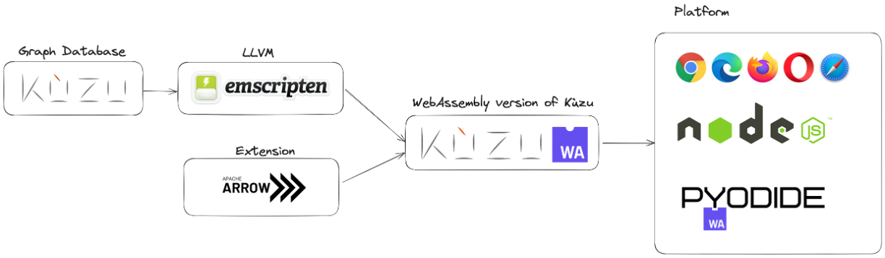

# What is Kùzu Wasm?
Kùzu Wasm is the WebAssembly version of the [Kùzu](https://github.com/kuzudb/kuzu) database system, designed to provide high-performance, in-browser serverless graph analysis. 

## Overview
By compiling Kuzu to WebAssembly, Kuzu-WASM enables asynchronous execution of Cypher queries within web workers, ensuring impressive query performance and scalability. With the integration of Apache Arrow for lossless data copying, Kuzu-WASM ensures data integrity and efficiency. Additionally, it includes a virtual file system for seamless file imports.

## Examples
Power by Kùzu WASM
- [Kuzu-Shell](https://kuzu-shell.netlify.app/)
- [Kuzu-Lab](https://kuzu-lab.netlify.app/)

## Performance
Kuzu-WASM is benchmarked against existing web data processing libraries using the LDBC, demonstrating superior performance across various workloads.